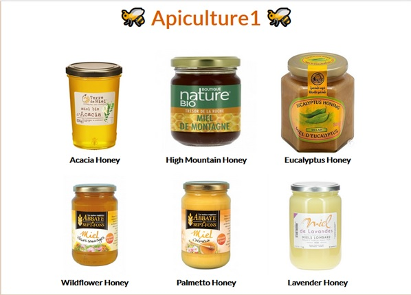
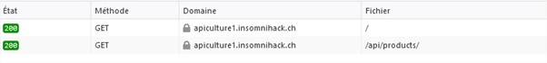
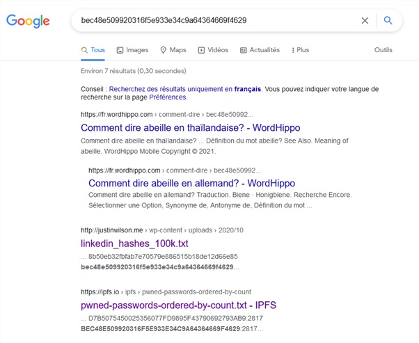

# Apiculture 1



Check at network how is filled the page : 



The product list calls `./api/products/` which returns: 
```json
[
    {
        "productId": 6,
        "name": "Acacia Honey",
        "vendorId": 57336
    },
    {
        "productId": 11,
        "name": "High Mountain Honey",
        "vendorId": 57336
    },
    {
        "productId": 16,
        "name": "Eucalyptus Honey",
        "vendorId": 57336
    },
    {
        "productId": 28,
        "name": "Wildflower Honey",
        "vendorId": 57336
    },
    {
        "productId": 41,
        "name": "Palmetto Honey",
        "vendorId": 57336
    },
    {
        "productId": 64,
        "name": "Lavender Honey",
        "vendorId": 57336
    }
]
```
The api may have a swagger definition : found at `./api/swagger.json`
```json
{
    "swagger": "2.0",
    "basePath": "/",
    "paths": {
        "/flags/": {
            "get": {
                "responses": {
                    "200": {
                        "description": "Success"
                    }
                },
                "operationId": "list_flags",
                "tags": [
                    "flags"
                ]
            }
        },
        "/products/": {
            "get": {
                "responses": {
                    "200": {
                        "description": "Success",
                        "schema": {
                            "type": "array",
                            "items": {
                                "$ref": "#/definitions/Product"
                            }
                        }
                    }
                },
                "operationId": "list_products",
                "tags": [
                    "products"
                ]
            }
        },
        "/vendors/{id}": {
            "parameters": [
                {
                    "in": "path",
                    "description": "The task identifier",
                    "name": "id",
                    "required": true,
                    "type": "integer"
                }
            ],
            "get": {
                "responses": {
                    "200": {
                        "description": "Success",
                        "schema": {
                            "$ref": "#/definitions/Product"
                        }
                    }
                },
                "summary": "Fetch a given resource",
                "operationId": "get_vendor",
                "tags": [
                    "vendors"
                ]
            }
        }
    },
    "info": {
        "title": "Welcome to Apiculture1!",
        "version": "1.0",
        "description": "A simple TodoMVC API"
    },
    "produces": [
        "application/json"
    ],
    "consumes": [
        "application/json"
    ],
    "tags": [
        {
            "name": "vendors"
        },
        {
            "name": "products"
        },
        {
            "name": "flags"
        }
    ],
    "definitions": {
        "Product": {
            "required": [
                "name",
                "vendorId"
            ],
            "properties": {
                "productId": {
                    "type": "integer",
                    "description": "",
                    "readOnly": true
                },
                "name": {
                    "type": "string",
                    "description": ""
                },
                "vendorId": {
                    "type": "integer",
                    "description": ""
                }
            },
            "type": "object"
        }
    },
    "responses": {
        "ParseError": {
            "description": "When a mask can't be parsed"
        },
        "MaskError": {
            "description": "When any error occurs on mask"
        }
    }
}
```

Try the `./api/flags/` url and get a basic authentification form. Well, we need a user !

Products have a `vendorId` and an api for vendor exists. Try to call this api with one of the `vendorId`. E.g. `./api/vendors/57336` returns
```json
{
    "vendorId": 57336,
    "fullname": "Sergei KHARITONOV",
    "email": "sergei.kharitonov@pride.jp",
    "birthdate": "18.08.1980",
    "passwordHash": "5baa61e4c9b93f3f0682250b6cf8331b7ee68fd8",
    "comment": "Unknown",
    "admin": false
}
```
A property named `admin` is set to false. Maybe an admin vendor exists. Try to increase and decrease the id. If it is out of range the api returns `Resource not found`. The wanted vendor is
```json
{
    "vendorId": 57332,
    "fullname": "Antonio Rodrigo NOGUEIRA",
    "email": "arn@gmail.br",
    "birthdate": "02.06.1976",
    "passwordHash": "bec48e509920316f5e933e34c9a64364669f4629",
    "comment": "Unknown",
    "admin": true
}
```

This password may be pawned.



Go back to the `./api/flags/` page and type for the user `arn@gmail.br` and for the pass `abeille`. And voilà !
```json
[
    {
        "flag": "INS{W1nn13Th3P00hW4$H3r3}"
    }
]
```