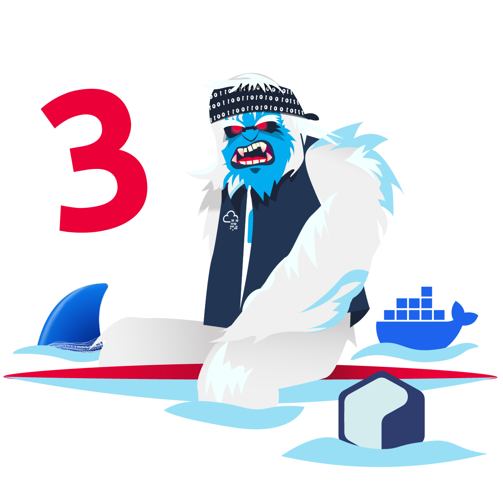

# Frosteau busy with Vim

The challenge is a walkthrough with several flags to find:
* What is the value of the first flag?
* What is the value of the second flag?
* What is the value of the third flag?
* What is the value of the fourth flag?
* What is the value of the third Yetikey that has been placed in the root directory to verify the compromise?