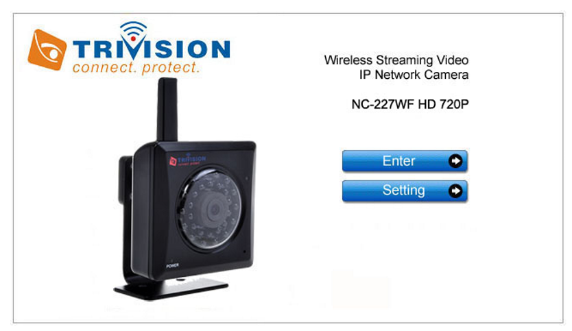

# Snowy ARMageddon

The challenge requests two answers:
* What is the content of the first flag?
* What is the content of the `yetikey2.txt` file?

Testing which port are open (think to search wide):

Let's browse the website (8080):

Let's browse the other port (50628):

When trying to login with test/test -> UserID required, with admin/admin -> wrong password.

A google search gove us the info that the cam is vulnerable with the `basic` parameter "limited" to 256 char. It's possible to overflow the stack.

To be continued...
