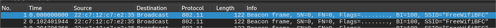
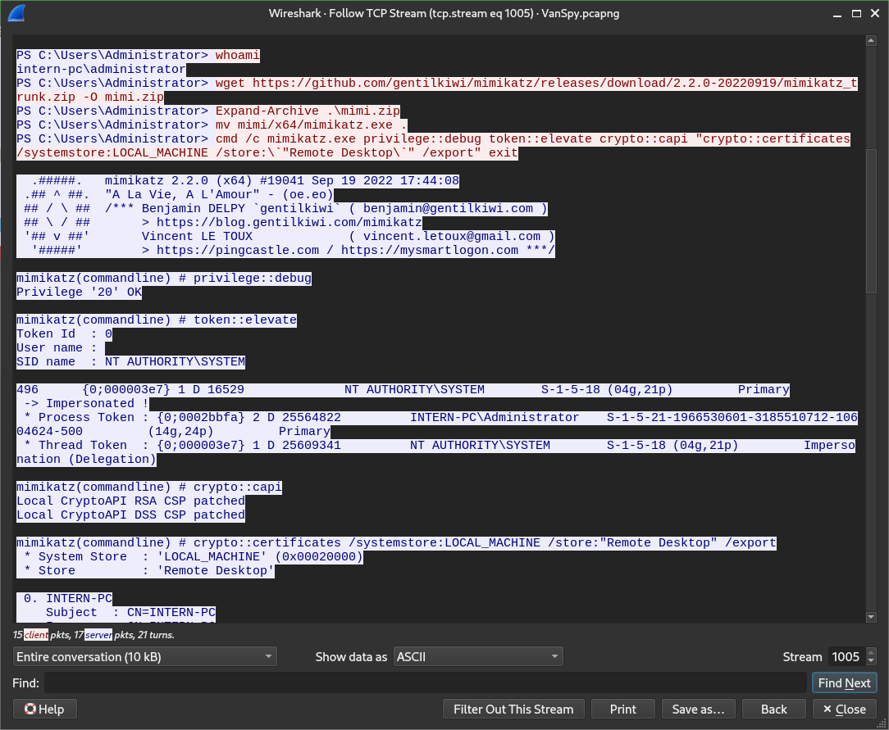

# The Return of the Yeti


In this challenge we are given a pcapng file and part of a walkthrough with 5 questions : 
 * What is the name of the Wifi ?
 * What is the pass for this Wifi ?
 * What software has been used to access juicy content ?
 * What is the case number ?
 * What is the content of the yetikey1.txt file ?

 For this challenge, we are using the software wireshark. Open the file with it. The first thing you see is the traffic with the Wifi: `FreeWifiBFC`
 

To crack the password, we are using hashcat. Before we have to extract all hashes from the pcapng with https://hashcat.net/cap2hashcat/. Save the file to test.hc22000. As it can take a while with brute fore, try before with knowned password. Download the list:
```
wget https://wpa-sec.stanev.org/dict/cracked.txt.gz
```
Then run hashcat:
```
hashcat -m 22000 test.hc22000 cracked.txt.gz
```
That returns: `Christmas`

In wireshark, enter the wpa pass in Preferences > Protocols > IEEE 802.11 : Decryption keys

It will decrpyt part of the network traffic.
As the introduction text let us known that the bandit was working just before leaving, go to the last TCP Stream (with a non null length) OPen the menu with right click. Select Follow TCP Stream. See the bash content with the executable: `mimikatz`


Continue scrolling to find the juicy data that is the private key:

Copy it into a file "cert.b64" and transform it to pfx and then to pem (so that it can be exploited by wireshark). Last command needs "mimikatz" as password : https://github.com/FreeRDP/FreeRDP/wiki/Mimikatz.
```
openssl base64 -d -A -in cert.b64 -out cert.pfx
openssl pkcs12 -in cert.pfx -nocerts -out cert.pem -nodes
```
In wireshark, add the key in Settings > Protocols > TLS : Add RSA key.

Now the RDP traffic is readeable. We are looking for user interaction. One useful is the clip board where is the case number: `31337-0`

Keep looking in next exchange (quite funny though), and see the content of the file: `1-1f9548f131522e85ea30e801dfd9b1a4e526003f9e83301faad85e6154ef2834`


And that's it, you got the 1rst flag !